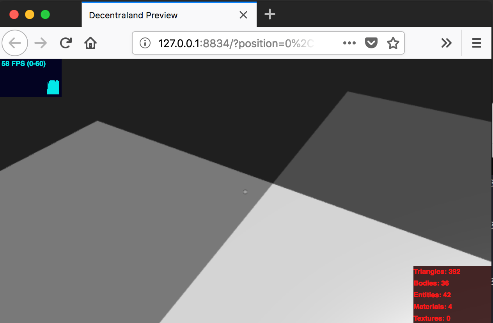
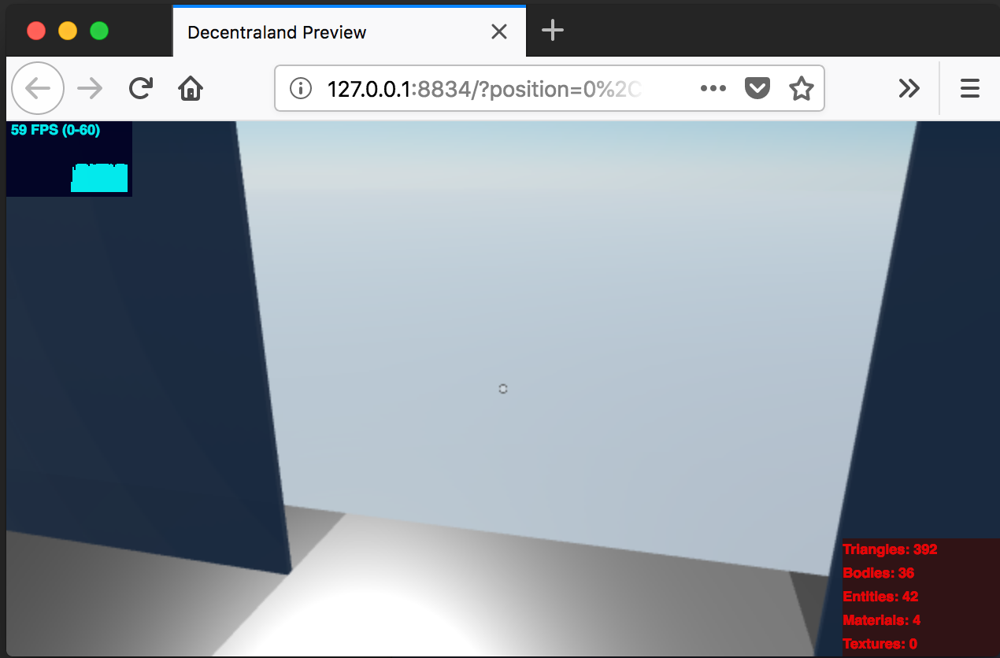
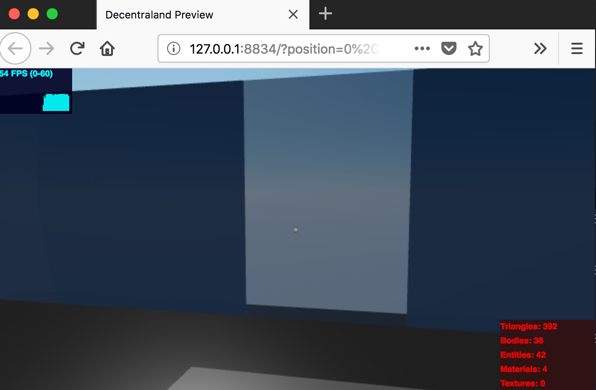
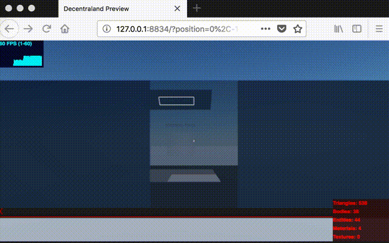

# sample-sync-websockets: Proximity Activation

Over in [Synchronize Websockets](./synchronize-websockets.md) we were going over how to connect to some Decentraland events called `positionChanged` and `rotationChanged`.

Now we can tie it together tracking our position, or all the characters connected to the server, and do something based on their position.

---

## Wait, school actually taught us a useful thing?

In the Decentraland chat I was talking with a new pal. We were going over some ideas and the API.

```
me: dood, I used Pythagoras' Theorem from school!
him: 😯 finally you got to use it!
me: 12+ years wasn't a total waste!
him: 😬
```

```ts
import { Vector3Component } from "decentraland-api";

/**
 * Pythagoras' Theorem implementation
 *
 * Get the distance between two points.
 *
 * Note: It uses {x,z} not {x,y}. The y-coordinate is how high up it is.
 */
function distance(pos1: Vector3Component, pos2: Vector3Component): number {
  const a = pos1.x - pos2.x;
  const b = pos1.z - pos2.z;
  return Math.sqrt(a * a + b * b);
}
```

(If I got it wrong just post an issue. I wasn't really paying attention in school.)

What can we do this with? **Proximity Activation Technique** in Decentraland is what.

`Vector3Component` just means `{x, y, z}`.

```ts
const player1 = { x: 1, y: 0, z: 1 }
const player2 = { x: 4, y: 0, z: 4 }
const activationDistance = 2
const spaceBetween = distance(player1, player2)

console.log("spaceBetween", spaceBetween)

if (spaceBetween <= activationDistance) {
  console.log("activate!")
} else {
  console.log("don't activate")
}

// spaceBetween 4.242640687119285
// don't activate
```

Lets move a bit closer:

```ts
const player3 = { x: 3, y: 0, z: 3 }
const player4 = { x: 3.5, y: 0, z: 3.5 }
const activationDistance = 2
const spaceBetween = distance(player3, player4)

console.log("spaceBetween", spaceBetween)

if (spaceBetween <= activationDistance) {
  console.log("activate!")
} else {
  console.log("don't activate")
}

// spaceBetween 0.7071067811865476
// activate!
```

Okay, we've got a system for proximity activation. This is what the `sample-sync-websockets` uses in order to light up the tiles and open the door.







You can see as another player goes into the scene it will sync their location and activate tiles or the door.



---

What could you imagine doing using this technique? Let me know!

Come find me in the Decentraland chat and show me what you come up with.

Thanks! -Tony Crowe `@tcrowe`

[Back to ./readme.md](./readme.md)
